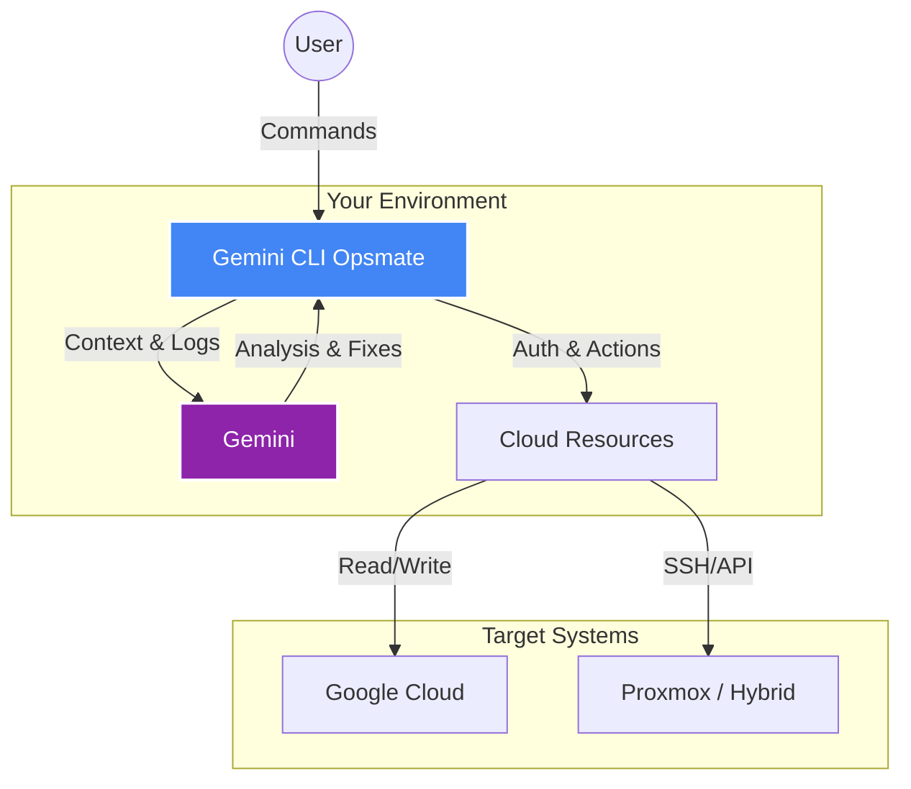

# gcp-gemini-troubleshooter

**A Read-Only Diagnostic Advisor for Google Cloud Platform**

`gcp-gemini-troubleshooter` is an experimental Gemini CLI implementation for Cloud Architects, and Power Users. It is prompted to as a reasoning engine that leverages the Gemini API to diagnose complex issues across a multi-cloud ecosystem without modifying your environment. I invite you to test, tune and extend this.

## 🛠 Project Structure
This repository is kept intentionally lean to serve as a portable "sidecar" for your terminal:
* `README.md`: Project overview and usage.
* `GEMINI.md`: System instructions and persona definitions (The "Brain").
* `gemini-extension.json`: The extension manifest for the Gemini CLI.
* `install-gemini-cli.sh`: A one-touch setup script for GCE environments.

## 🛡 The "Read-Only Advisor" Philosophy
This tool follows a strict **Observer-Only** pattern. It is designed to:
1. **Analyze:** Parse logs and configurations.
2. **Reason:** Identify bottlenecks or misconfigurations across product boundaries.
3. **Advise:** Provide commands or architectural changes for the user to execute manually.

*It will never execute `gcloud compute instances delete` or any state-changing command.*

## ⚠️ Prerequisites & Permissions
This tool relies on local CLLI (**`gcloud`, `awscli`, etc**) to fetch diagnostic data.
* **IAM Permissions:** It uses *your* local authenticated` session. You must have sufficient permissions (e.g., `Viewer`, `Security Viewer`) for the resources you are diagnosing.
* **Non-Destructive:** The advisor is strictly read-only. It suggests paths; it does not execute state-changing commands.


    
## 📚 Specialized Diagnostic Domains
Rather than bundling static docs, this implementation is grounded in the live official documentation for the following core GCP areas:

* **[Observability](https://cloud.google.com/stackdriver/docs):** Deep dives into Cloud Logging, Monitoring, and Trace.
* **[Security & IAM](https://cloud.google.com/iam/docs):** Troubleshooting permission denials and Service Account scopes.
* **[Vertex AI](https://cloud.google.com/vertex-ai/docs):** Diagnosing training jobs, endpoint latency, and quota issues.
* **[Core Infrastructure](https://cloud.google.com/docs):** Networking (VPC), GCE, and GKE.
* **[AWS Dcoumenantation](docs.aws.amazon.com):**
* **[Azure Documentation](learn.microsoft.com/en-us/cli/azure):** 
* **[VMware Documentation](docs.vmware.com):**
* **[Proxmox Wiki](pve.proxmox.com/wiki):**

## 🚀 Quick Start (On a workstation with the required multi-cloud permissions)
1. Clone the repository:
   ```bash
   git clone https://github.com/bernieongewe/gcp-gemini-troubleshooter.git
   cd gcp-gemini-troubleshooter
   ```
2. Install extension:
   ```bash
   bash setup-environment.sh
   gemini extensions install https://github.com/bernieongewe/gcp-gemini-troubleshooter
   ```
> **Note:** This is a personal project and is not an officially supported Google product.
